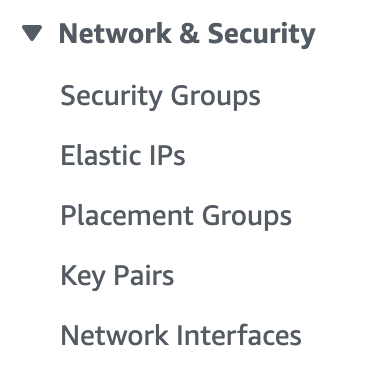
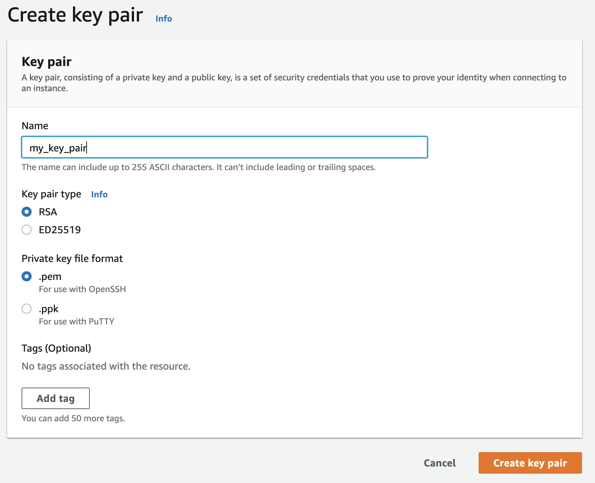

# Kitchen EC2 Amazon

This repository describes Test Kitchen plugins for testing Terraform configuration.

We are create infrastructure in AWS and using the Test Kitchen plugin to see of our created configuration is actually an Ubuntu server

# Prerequisites

Vagrant [See documentation](https://www.vagrantup.com/docs/installation)  
Virtualbox [See documentation](https://www.virtualbox.org/wiki/Downloads)

# How to

## Create your AWS key pair
1. Login to AWS console to create a key pair
2. Go to EC2
3. Under network and Security go to Key Pairs  
  
4. select create key pair    
    
5. Give a name which you need later during the kitchen exercise and click create Key Pair  
  
6. You now have downloaded a file ```my_key_pair.pem```. You need this file later
7. During the exercise the pem file location should be ```/vagrant/me_key_pair.pem```

## Use the Test Kitchen plugin
1. Clone the repository to your local machine
```
git clone https://github.com/munnep/kitchen_ec2.git
```
2. Change your directory
```
cd kitchen_ec2
```
3. copy the downloaded ```my_key_pair.pem``` file to the current directory
4. create a file called ```testing.tfvars```
```
vi testing.tfvars
```
5. Add your own information for aws
```
key_name = "my_key_pair"
region = "us-east-1"
ami = "ami-fce3c696"
instance_type = "m3.medium"
aws_access_key_id= "..."
aws_secret_access_key= "..."
aws_session_token= "..."
```
6. edit the file ```.kitchen.yml``` 
```
vi .kitchen.yml
```
7. make sure the following reflects your filename. Key name after the ```/vagrant``` directory
```
      key_files:
        - /vagrant/my_key_pair.pem
```
8. Start a virtual machine with Vagrant
```
vagrant up
```
9. ssh into the virtual machine with Vagrant.
```
vagrant ssh
```
10. Go to the ```/vagrant``` directory
```
cd /vagrant
```
11. create the infrastructure
```
bundle exec kitchen converge
```
12. you should see the output that the infrastructure is created
```
Changes to Outputs:
         + public_dns = (known after apply)
       aws_security_group.allow_ssh: Creating...
       aws_security_group.allow_ssh: Creation complete after 5s [id=sg-0327bf91c477cf964]
       aws_instance.example: Creating...
       aws_instance.example: Still creating... [10s elapsed]
       aws_instance.example: Still creating... [21s elapsed]
       aws_instance.example: Creation complete after 27s [id=i-0f533c5dac7979c2a]
       
       Apply complete! Resources: 2 added, 0 changed, 0 destroyed.
       
       Outputs:
       
       public_dns = "ec2-3-82-209-95.compute-1.amazonaws.com"
```
13. Run a kitchen verify test. This wil test if the server created is actually an ubuntu image. (wait a few minutes after creating the infrastructure)
```
bundle exec kitchen verify
```
14. See the result which should say the expected server is Ubuntu
```
...
Command: `lsb_release -a`
  stdout
    is expected to match /Ubuntu/

Finished in 0.28512 seconds (files took 8.59 seconds to load)
1 example, 0 failures
...
```
15. To make a false positive you change the test to check if the server is fedora. Edit the file 
```
vim test/integration/default/controls/operating_system_spec.rb
```
16. Change the value of Ubuntu to fedora
```
control 'operating_system' do
  describe command('lsb_release -a') do
    its('stdout') { should match (/Fedora/) }
  end
end
```
17. Run the kitchen verify test
```
bundle exec kitchen verify
```
18. Now you will see errors like the following
```
Finished in 0.28944 seconds (files took 3.56 seconds to load)
1 example, 1 failure

Failed examples:

```
19. Destroy the infrastructure in AWS again
```
bundle exec kitchen destroy
```
20. exit out of the vagrant machine
```
exit
```
21. Stop the vagrant machine
```
vagrant halt
```
22. When you are completely done you can remove it
```
vagrant destroy
```